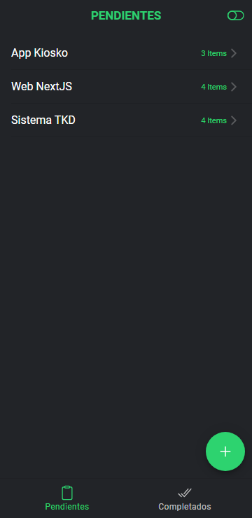
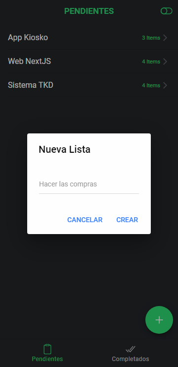
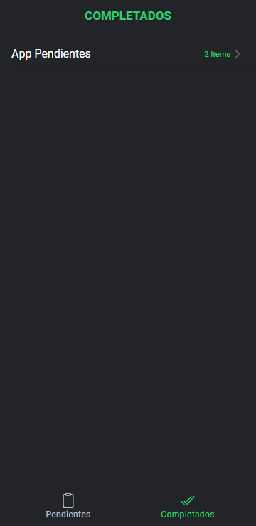
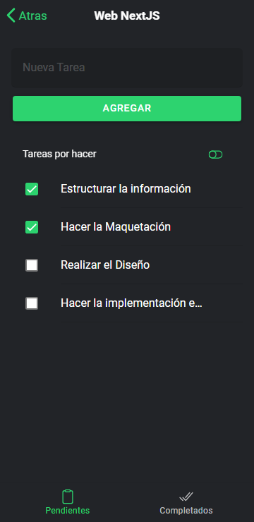

# APLICACIÓN DE PENDIENTES

## Aplicación para el control de pendientes desarrollada en IONIC con ANGULAR

&nbsp; 

~~~
    -Agregar
    -Editar
    -Eliminar
    -Reordenar
~~~

&nbsp; 

'

&nbsp; 

'

&nbsp; 

'

&nbsp; 

'